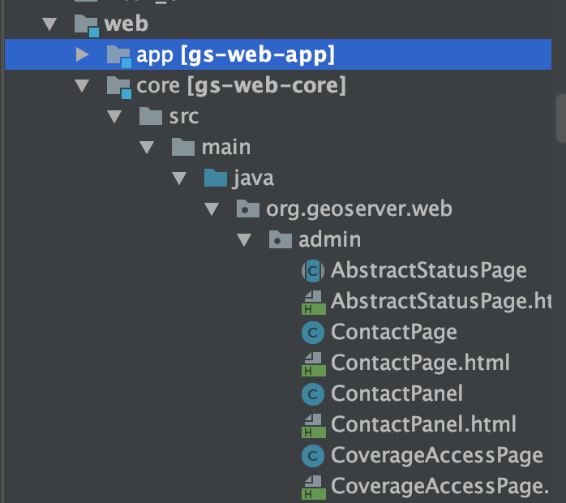
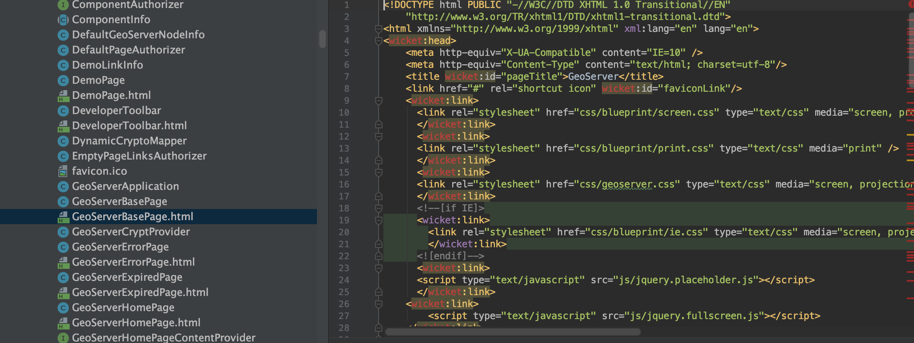

通过查看源码，发现页面相关的代码位置在web模块。基础页面代码在web模块下的core




查看源码，发现如下引用


```
org.apache.wicket.markup.html;
```


应该是使用了[wicket](http://wicket.apache.org/)，第一次接触该项技术。

##  wicket

Wicket，一个开发Java Web应用程序框架。它使得开发web应用程序变得容易而轻松。


[wicket学习笔记&创建一个登陆界面](https://blog.csdn.net/u010608964/article/details/88046953)

wicket代码结构：


比如:

AboutGeoServerPage.html定义界面

AboutGeoServerPage.java定义内容


GeoServerBasePage.html是页面的基础部分，其他部分有些像组件化的意思。

GeoServerBasePage相当于一般页面的header部分



源码中提供的信息是这样的：

> Home page, shows just the introduction and the capabilities link


